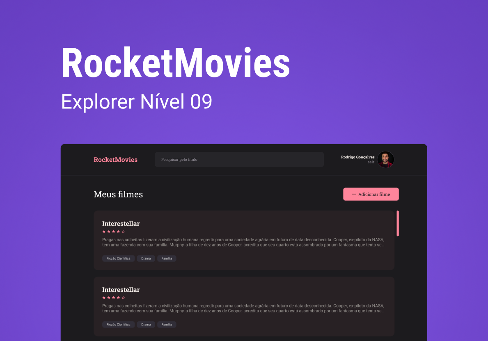
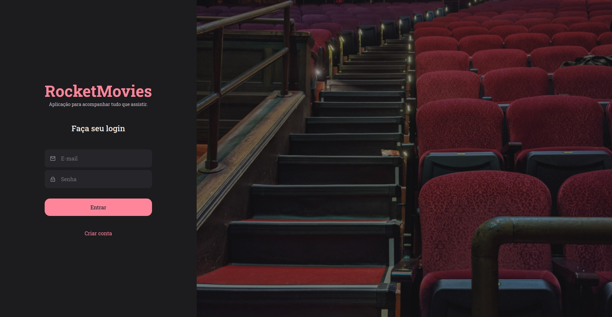
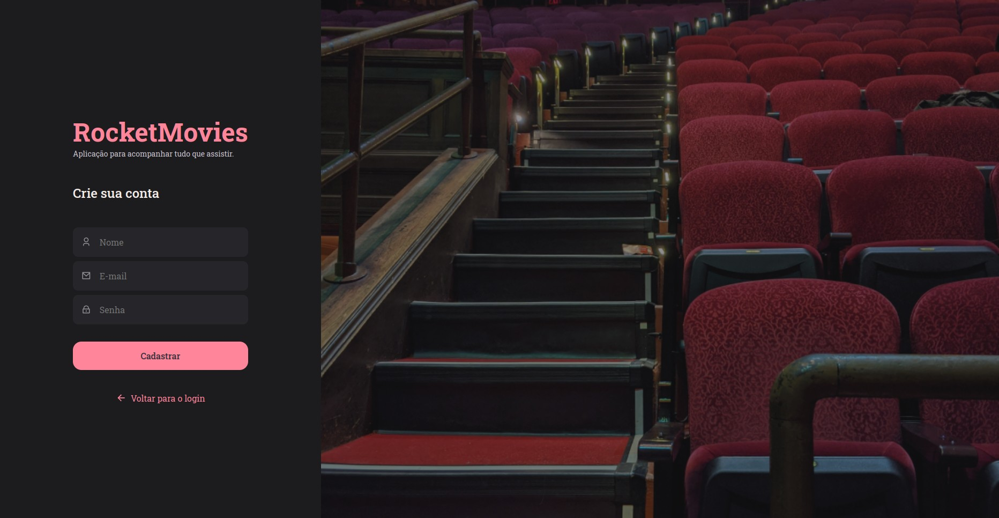
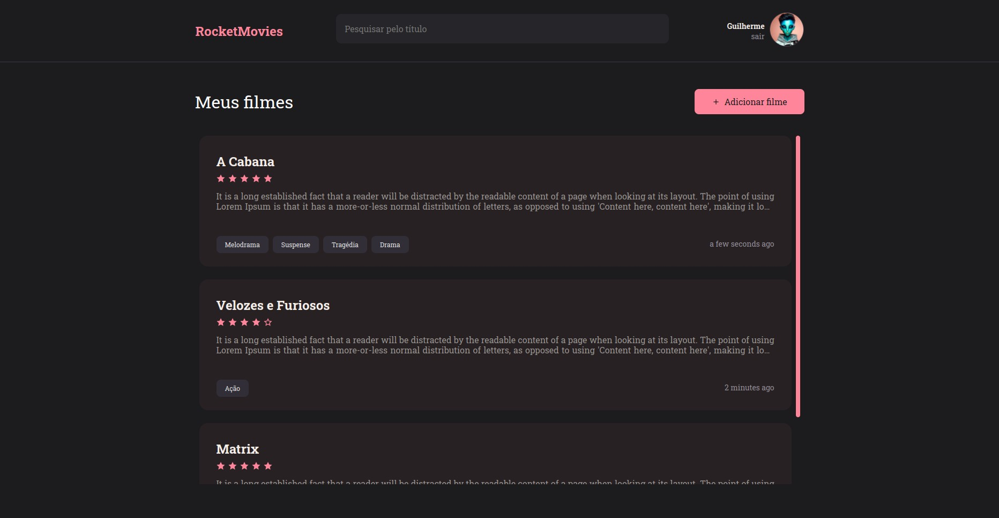
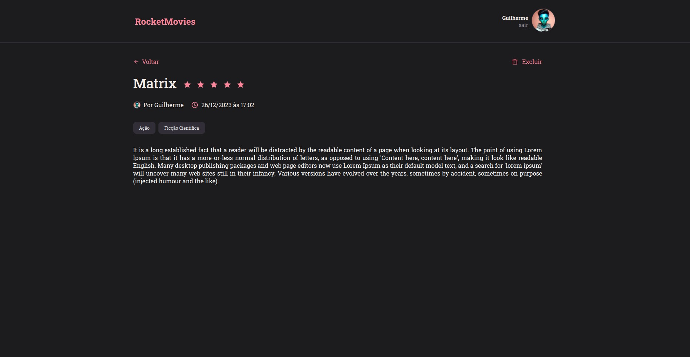
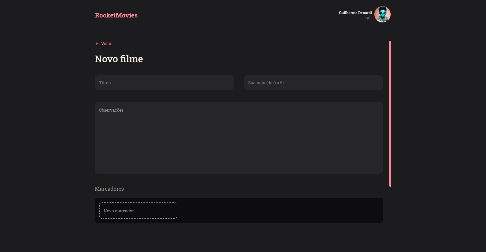
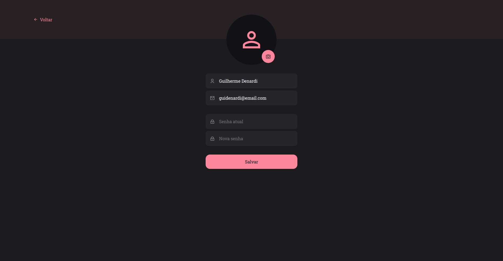
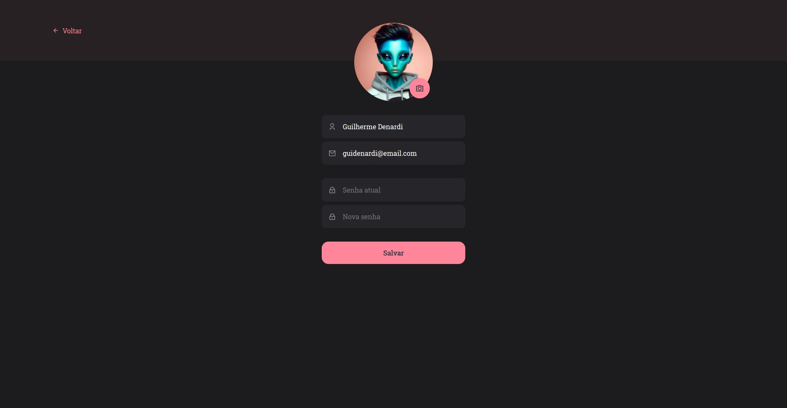

# RocketMovies (Front-end)

Projeto desenvolvido como desafio do Stage 9 do programa Explorer da Rocketseat.

Este projeto foi desenvolvido para possibilitar o usuário gerenciar os filmes que já assistiu. Sendo possível adicionar novos filmes, editar a descrição do filme, dar uma nota de 0 a 5 e categorizar por gêneros.

## Stack utilizada

React

Styled Components

## Funcionalidades

- Gerenciar filmes assistidos

- Adicionar novos filmes

- Editar a descrição do filme

- Avaliar o filme dando uma nota de 0 a 5

- Categorizar por gêneros

- Remover filmes de sua lista

- Customizar o perfil do usuário, como nome e foto do perfil

## Aprendizados

Neste projeto aprendi a utilizar o biblioteca React para criação de interface, estilização com Styled Components, React Router DOM, adicionar estilizações globais com CSS, organização das pastas do projeto, entre outros.

## Screenshots

### SignIn Screen

### SignUp Screen

### Home Screen

### Movie Preview

### Creating Move

### Profile Screen

### Profile Update Screen

## Melhorias

Próximo passo é deixar este projeto completamente responsivo.

## Autores

- [@guidenardideveloper](https://www.github.com/guidenardideveloper)

## Layout
[@rocketseat](https://github.com/Rocketseat)